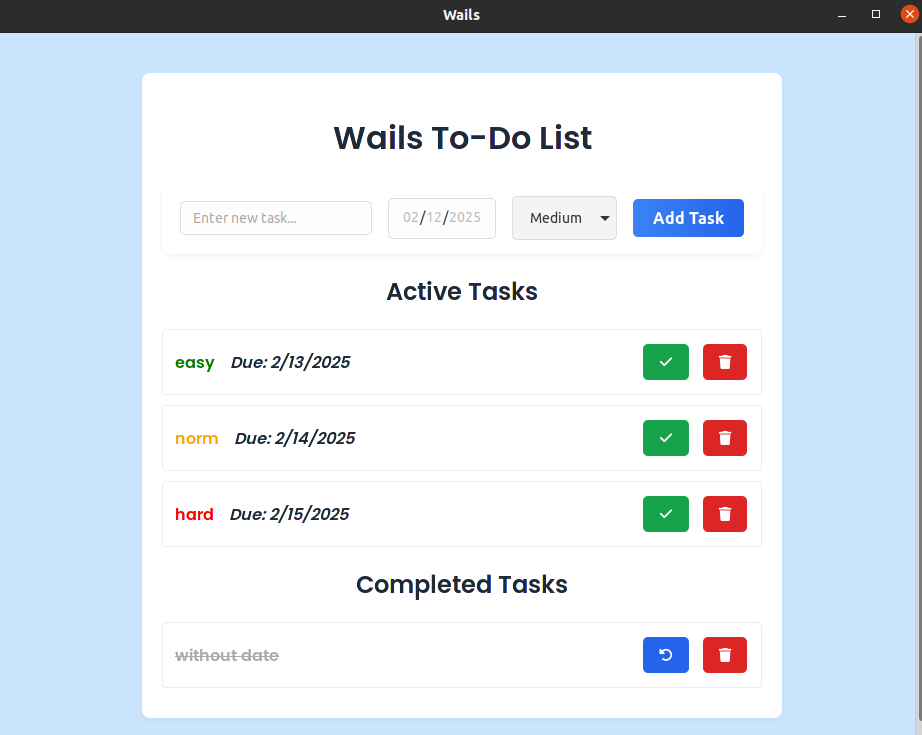

# Wails To-Do List Application

This is a cross-platform desktop application for managing a to-do list, built with [Wails](https://wails.io/), Go, and React. The application allows you to create, view, mark, and delete tasks. Each task has a title, a due date (date only), and a priority level (Low, Medium, or High). Task data is stored locally in a JSON file so that your tasks persist between sessions.



## Features

- **Task Management:**
    - Add new tasks with a title, due date, and priority.
    - View tasks divided into Active and Completed lists.
    - Mark tasks as complete/incomplete.
    - Delete tasks with confirmation.

- **Data Persistence:**
    - Tasks are stored in a local JSON file (e.g., `tasks.json`), ensuring that your tasks are saved between application restarts.

- **Modern UI:**
    - Built with React and styled using a minimalistic blue-themed design.
    - Uses Vite for fast development and bundling.

- **Wails Integration:**
    - A native desktop application powered by Wails for a seamless cross-platform experience.

## Technologies Used

- **Go** – Backend logic and data handling.
- **JSON** – Local data storage (tasks are saved in a JSON file).
- **React** – Frontend user interface.
- **Wails** – Framework for building native desktop applications with Go and JavaScript.

## Installation and Setup

### Prerequisites

- [Go 1.21 or later](https://golang.org/dl/)
- [Node.js 21.x or later](https://nodejs.org/)
- [Wails CLI](https://wails.io/docs/gettingstarted/installation/)  
  Install with:
  ```bash
  go install github.com/wailsapp/wails/v2/cmd/wails@latest
    ```
  Clone the Repository
  ```bash  
    git clone https://github.com/don1yal/GO_TODO
    cd GO_TODO
  ```
    Install Dependencies

    From the root directory of the project, run:
    ```bash
    wails build -clean
    ```
  
    This command will install both Go and Node.js dependencies.

    To ensure that all dependencies are correctly installed, run:
    ```bash
    wails doctor
    ```
    Running the Application

    To run the application in development mode, from the root directory (where wails.json is located), execute:
    ```bash
    wails dev
    ```